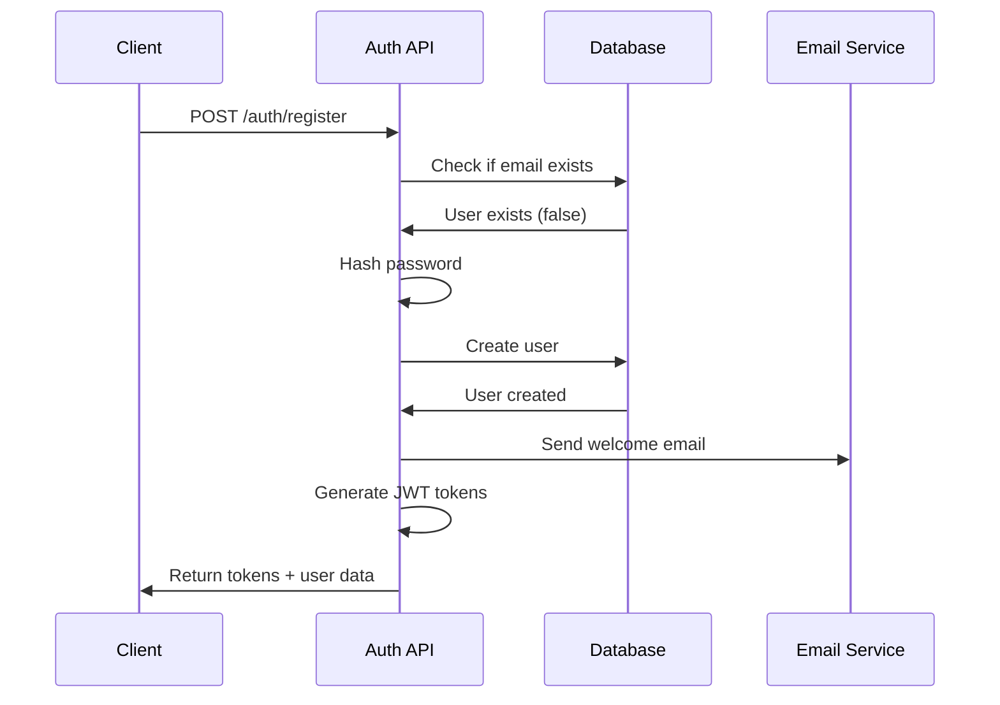
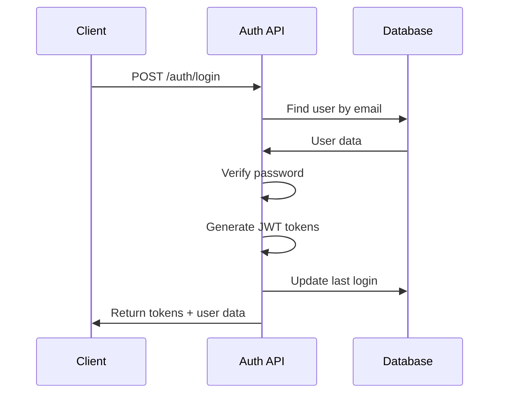
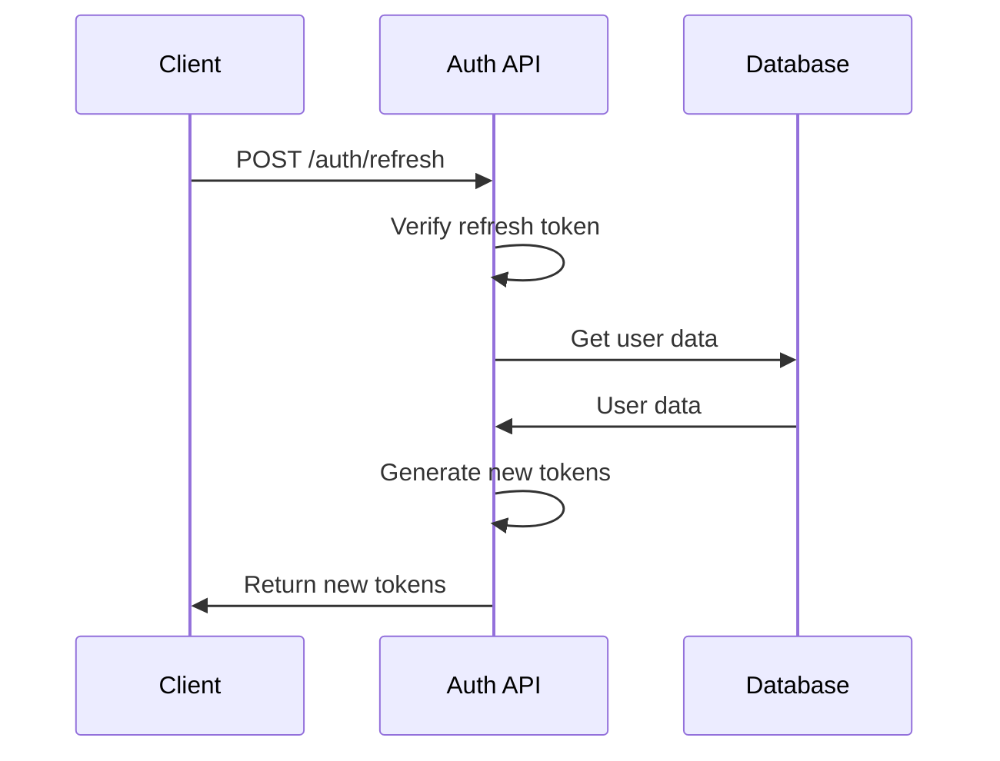

# Authentication API Documentation

## 🔐 Overview

The Authentication API provides secure user authentication and authorization services for the ANVIY e-commerce platform. It uses JWT (JSON Web Tokens) for stateless authentication with refresh token support.

## 🏗️ Authentication Flow

### 1. User Registration


### 2. User Login


### 3. Token Refresh


## 📋 API Endpoints

### Base URL
```
https://api.anviy.com/v1
```

### Authentication Headers
```http
Authorization: Bearer <access_token>
Content-Type: application/json
```

## 🔑 Endpoints

### 1. User Registration

**POST** `/auth/register`

Register a new user account.

#### Request Body
```json
{
  "name": "John Doe",
  "email": "john@example.com",
  "password": "SecurePassword123!",
  "phone": "+919876543210"
}
```

#### Request Schema
```typescript
interface RegisterRequest {
  name: string;           // Required, 2-100 characters
  email: string;          // Required, valid email format
  password: string;       // Required, 8+ characters, strong password
  phone?: string;         // Optional, valid phone format
}
```

#### Response (201 Created)
```json
{
  "success": true,
  "data": {
    "user": {
      "id": "uuid",
      "name": "John Doe",
      "email": "john@example.com",
      "phone": "+919876543210",
      "avatar": null,
      "emailVerified": false,
      "phoneVerified": false,
      "role": "customer",
      "createdAt": "2024-12-01T10:00:00Z",
      "updatedAt": "2024-12-01T10:00:00Z"
    },
    "token": "eyJhbGciOiJIUzI1NiIsInR5cCI6IkpXVCJ9...",
    "refreshToken": "eyJhbGciOiJIUzI1NiIsInR5cCI6IkpXVCJ9..."
  },
  "message": "User registered successfully"
}
```

#### Response Schema
```typescript
interface RegisterResponse {
  success: boolean;
  data: {
    user: User;
    token: string;
    refreshToken: string;
  };
  message: string;
}
```

#### Error Responses

**400 Bad Request** - Validation Error
```json
{
  "success": false,
  "error": "VALIDATION_ERROR",
  "message": "Validation failed",
  "details": {
    "email": ["Email is already registered"],
    "password": ["Password must be at least 8 characters"]
  }
}
```

**409 Conflict** - Email Already Exists
```json
{
  "success": false,
  "error": "EMAIL_EXISTS",
  "message": "Email is already registered"
}
```

### 2. User Login

**POST** `/auth/login`

Authenticate user and return access tokens.

#### Request Body
```json
{
  "email": "john@example.com",
  "password": "SecurePassword123!"
}
```

#### Request Schema
```typescript
interface LoginRequest {
  email: string;          // Required, valid email format
  password: string;       // Required
}
```

#### Response (200 OK)
```json
{
  "success": true,
  "data": {
    "user": {
      "id": "uuid",
      "name": "John Doe",
      "email": "john@example.com",
      "phone": "+919876543210",
      "avatar": "https://example.com/avatar.jpg",
      "emailVerified": true,
      "phoneVerified": false,
      "role": "customer",
      "lastLoginAt": "2024-12-01T10:00:00Z",
      "createdAt": "2024-12-01T09:00:00Z",
      "updatedAt": "2024-12-01T10:00:00Z"
    },
    "token": "eyJhbGciOiJIUzI1NiIsInR5cCI6IkpXVCJ9...",
    "refreshToken": "eyJhbGciOiJIUzI1NiIsInR5cCI6IkpXVCJ9..."
  },
  "message": "Login successful"
}
```

#### Error Responses

**401 Unauthorized** - Invalid Credentials
```json
{
  "success": false,
  "error": "INVALID_CREDENTIALS",
  "message": "Invalid email or password"
}
```

**403 Forbidden** - Account Disabled
```json
{
  "success": false,
  "error": "ACCOUNT_DISABLED",
  "message": "Account is disabled"
}
```

### 3. Get Current User

**GET** `/auth/me`

Get current authenticated user's profile.

#### Headers
```http
Authorization: Bearer <access_token>
```

#### Response (200 OK)
```json
{
  "success": true,
  "data": {
    "id": "uuid",
    "name": "John Doe",
    "email": "john@example.com",
    "phone": "+919876543210",
    "avatar": "https://example.com/avatar.jpg",
    "emailVerified": true,
    "phoneVerified": false,
    "role": "customer",
    "lastLoginAt": "2024-12-01T10:00:00Z",
    "createdAt": "2024-12-01T09:00:00Z",
    "updatedAt": "2024-12-01T10:00:00Z"
  }
}
```

#### Error Responses

**401 Unauthorized** - Invalid Token
```json
{
  "success": false,
  "error": "INVALID_TOKEN",
  "message": "Invalid or expired token"
}
```

### 4. Refresh Token

**POST** `/auth/refresh`

Refresh access token using refresh token.

#### Request Body
```json
{
  "refreshToken": "eyJhbGciOiJIUzI1NiIsInR5cCI6IkpXVCJ9..."
}
```

#### Request Schema
```typescript
interface RefreshRequest {
  refreshToken: string;   // Required, valid refresh token
}
```

#### Response (200 OK)
```json
{
  "success": true,
  "data": {
    "token": "eyJhbGciOiJIUzI1NiIsInR5cCI6IkpXVCJ9...",
    "refreshToken": "eyJhbGciOiJIUzI1NiIsInR5cCI6IkpXVCJ9..."
  },
  "message": "Token refreshed successfully"
}
```

#### Error Responses

**401 Unauthorized** - Invalid Refresh Token
```json
{
  "success": false,
  "error": "INVALID_REFRESH_TOKEN",
  "message": "Invalid or expired refresh token"
}
```

### 5. Logout

**POST** `/auth/logout`

Logout user and invalidate tokens.

#### Headers
```http
Authorization: Bearer <access_token>
```

#### Request Body
```json
{
  "refreshToken": "eyJhbGciOiJIUzI1NiIsInR5cCI6IkpXVCJ9..."
}
```

#### Response (200 OK)
```json
{
  "success": true,
  "message": "Logged out successfully"
}
```

### 6. Forgot Password

**POST** `/auth/forgot-password`

Send password reset email.

#### Request Body
```json
{
  "email": "john@example.com"
}
```

#### Request Schema
```typescript
interface ForgotPasswordRequest {
  email: string;          // Required, valid email format
}
```

#### Response (200 OK)
```json
{
  "success": true,
  "message": "Password reset email sent"
}
```

#### Error Responses

**404 Not Found** - Email Not Found
```json
{
  "success": false,
  "error": "EMAIL_NOT_FOUND",
  "message": "Email not found"
}
```

### 7. Reset Password

**POST** `/auth/reset-password`

Reset password using reset token.

#### Request Body
```json
{
  "token": "reset_token_here",
  "password": "NewSecurePassword123!"
}
```

#### Request Schema
```typescript
interface ResetPasswordRequest {
  token: string;          // Required, valid reset token
  password: string;       // Required, 8+ characters, strong password
}
```

#### Response (200 OK)
```json
{
  "success": true,
  "message": "Password reset successfully"
}
```

#### Error Responses

**400 Bad Request** - Invalid Token
```json
{
  "success": false,
  "error": "INVALID_RESET_TOKEN",
  "message": "Invalid or expired reset token"
}
```

### 8. Verify Email

**POST** `/auth/verify-email`

Verify email address using verification token.

#### Request Body
```json
{
  "token": "verification_token_here"
}
```

#### Request Schema
```typescript
interface VerifyEmailRequest {
  token: string;          // Required, valid verification token
}
```

#### Response (200 OK)
```json
{
  "success": true,
  "message": "Email verified successfully"
}
```

#### Error Responses

**400 Bad Request** - Invalid Token
```json
{
  "success": false,
  "error": "INVALID_VERIFICATION_TOKEN",
  "message": "Invalid or expired verification token"
}
```

## 🔒 Security Features

### JWT Token Structure

#### Access Token
```json
{
  "header": {
    "alg": "HS256",
    "typ": "JWT"
  },
  "payload": {
    "sub": "user_id",
    "email": "user@example.com",
    "role": "customer",
    "iat": 1701432000,
    "exp": 1701435600
  }
}
```

#### Refresh Token
```json
{
  "header": {
    "alg": "HS256",
    "typ": "JWT"
  },
  "payload": {
    "sub": "user_id",
    "type": "refresh",
    "iat": 1701432000,
    "exp": 1702036800
  }
}
```

### Token Configuration

```typescript
interface TokenConfig {
  accessToken: {
    expiresIn: '15m';     // 15 minutes
    algorithm: 'HS256';
  };
  refreshToken: {
    expiresIn: '7d';      // 7 days
    algorithm: 'HS256';
  };
}
```

### Password Requirements

```typescript
interface PasswordRequirements {
  minLength: 8;
  requireUppercase: true;
  requireLowercase: true;
  requireNumbers: true;
  requireSpecialChars: true;
  maxLength: 128;
}
```

## 🚨 Error Codes

| Code | Description |
|------|-------------|
| `VALIDATION_ERROR` | Request validation failed |
| `EMAIL_EXISTS` | Email is already registered |
| `INVALID_CREDENTIALS` | Invalid email or password |
| `ACCOUNT_DISABLED` | User account is disabled |
| `INVALID_TOKEN` | Invalid or expired access token |
| `INVALID_REFRESH_TOKEN` | Invalid or expired refresh token |
| `EMAIL_NOT_FOUND` | Email address not found |
| `INVALID_RESET_TOKEN` | Invalid or expired reset token |
| `INVALID_VERIFICATION_TOKEN` | Invalid or expired verification token |
| `RATE_LIMIT_EXCEEDED` | Too many requests |
| `INTERNAL_SERVER_ERROR` | Internal server error |

## 📊 Rate Limiting

### Limits
- **Registration**: 5 requests per hour per IP
- **Login**: 10 requests per hour per IP
- **Password Reset**: 3 requests per hour per email
- **Token Refresh**: 100 requests per hour per user

### Headers
```http
X-RateLimit-Limit: 10
X-RateLimit-Remaining: 9
X-RateLimit-Reset: 1701435600
```

## 🔧 Implementation Notes

### Frontend Integration

```typescript
// Example API client usage
import { authAPI } from '@/lib/api';

// Register user
const registerUser = async (userData: RegisterRequest) => {
  try {
    const response = await authAPI.register(userData);
    // Store tokens in localStorage
    localStorage.setItem('auth_token', response.token);
    localStorage.setItem('refresh_token', response.refreshToken);
    return response;
  } catch (error) {
    throw error;
  }
};

// Login user
const loginUser = async (credentials: LoginRequest) => {
  try {
    const response = await authAPI.login(credentials);
    // Store tokens in localStorage
    localStorage.setItem('auth_token', response.token);
    localStorage.setItem('refresh_token', response.refreshToken);
    return response;
  } catch (error) {
    throw error;
  }
};

// Get current user
const getCurrentUser = async () => {
  try {
    const response = await authAPI.getCurrentUser();
    return response;
  } catch (error) {
    // Handle token refresh or logout
    throw error;
  }
};
```

### Token Refresh Strategy

```typescript
// Automatic token refresh
const refreshTokenIfNeeded = async () => {
  const token = localStorage.getItem('auth_token');
  const refreshToken = localStorage.getItem('refresh_token');
  
  if (!token || !refreshToken) {
    throw new Error('No tokens available');
  }
  
  try {
    // Decode token to check expiration
    const decoded = jwt_decode(token);
    const now = Date.now() / 1000;
    
    // Refresh if token expires in next 5 minutes
    if (decoded.exp - now < 300) {
      const response = await authAPI.refreshToken(refreshToken);
      localStorage.setItem('auth_token', response.token);
      localStorage.setItem('refresh_token', response.refreshToken);
      return response.token;
    }
    
    return token;
  } catch (error) {
    // Clear tokens and redirect to login
    localStorage.removeItem('auth_token');
    localStorage.removeItem('refresh_token');
    throw error;
  }
};
```

## 📝 Testing

### Test Cases

```typescript
describe('Authentication API', () => {
  test('should register new user', async () => {
    const userData = {
      name: 'Test User',
      email: 'test@example.com',
      password: 'TestPassword123!'
    };
    
    const response = await authAPI.register(userData);
    expect(response.success).toBe(true);
    expect(response.data.user.email).toBe(userData.email);
  });
  
  test('should login existing user', async () => {
    const credentials = {
      email: 'test@example.com',
      password: 'TestPassword123!'
    };
    
    const response = await authAPI.login(credentials);
    expect(response.success).toBe(true);
    expect(response.data.token).toBeDefined();
  });
  
  test('should reject invalid credentials', async () => {
    const credentials = {
      email: 'test@example.com',
      password: 'WrongPassword'
    };
    
    await expect(authAPI.login(credentials)).rejects.toThrow('Invalid credentials');
  });
});
```

---

**Last Updated**: December 2024  
**Version**: 1.0.0  
**API Version**: v1
