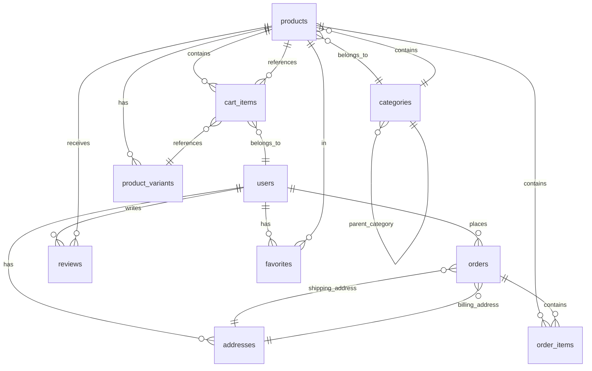

# Database Schema Documentation

## 🗄️ Database Overview

The ANVIY e-commerce platform uses PostgreSQL as the primary database with a well-structured schema designed for scalability, performance, and data integrity.

## 🏗️ Database Architecture

### Database Engine
- **Primary Database**: PostgreSQL 14+
- **Connection Pooling**: PgBouncer (production)
- **Backup Strategy**: Automated daily backups
- **Replication**: Read replicas for scaling

### Schema Design Principles
- **Normalization**: 3NF compliance
- **Indexing**: Strategic indexing for performance
- **Constraints**: Data integrity constraints
- **Audit Trail**: Comprehensive logging

## 📊 Database Schema

### Entity Relationship Diagram



## 📋 Table Definitions

### 1. Users Table

```sql
CREATE TABLE users (
    id UUID PRIMARY KEY DEFAULT gen_random_uuid(),
    email VARCHAR(255) UNIQUE NOT NULL,
    password_hash VARCHAR(255) NOT NULL,
    name VARCHAR(255) NOT NULL,
    phone VARCHAR(20),
    avatar_url VARCHAR(500),
    email_verified BOOLEAN DEFAULT FALSE,
    phone_verified BOOLEAN DEFAULT FALSE,
    is_active BOOLEAN DEFAULT TRUE,
    role USER_ROLE DEFAULT 'customer',
    last_login_at TIMESTAMP,
    created_at TIMESTAMP DEFAULT CURRENT_TIMESTAMP,
    updated_at TIMESTAMP DEFAULT CURRENT_TIMESTAMP
);

-- Indexes
CREATE INDEX idx_users_email ON users(email);
CREATE INDEX idx_users_phone ON users(phone);
CREATE INDEX idx_users_role ON users(role);
CREATE INDEX idx_users_created_at ON users(created_at);
```

**User Roles Enum:**
```sql
CREATE TYPE user_role AS ENUM (
    'customer',
    'admin',
    'manager',
    'support'
);
```

### 2. Categories Table

```sql
CREATE TABLE categories (
    id UUID PRIMARY KEY DEFAULT gen_random_uuid(),
    name VARCHAR(255) NOT NULL,
    slug VARCHAR(255) UNIQUE NOT NULL,
    description TEXT,
    image_url VARCHAR(500),
    parent_id UUID REFERENCES categories(id),
    sort_order INTEGER DEFAULT 0,
    is_active BOOLEAN DEFAULT TRUE,
    meta_title VARCHAR(255),
    meta_description TEXT,
    created_at TIMESTAMP DEFAULT CURRENT_TIMESTAMP,
    updated_at TIMESTAMP DEFAULT CURRENT_TIMESTAMP
);

-- Indexes
CREATE INDEX idx_categories_slug ON categories(slug);
CREATE INDEX idx_categories_parent_id ON categories(parent_id);
CREATE INDEX idx_categories_is_active ON categories(is_active);
CREATE INDEX idx_categories_sort_order ON categories(sort_order);
```

### 3. Products Table

```sql
CREATE TABLE products (
    id UUID PRIMARY KEY DEFAULT gen_random_uuid(),
    name VARCHAR(255) NOT NULL,
    slug VARCHAR(255) UNIQUE NOT NULL,
    description TEXT,
    short_description VARCHAR(500),
    price DECIMAL(10,2) NOT NULL,
    sale_price DECIMAL(10,2),
    cost_price DECIMAL(10,2),
    sku VARCHAR(100) UNIQUE,
    barcode VARCHAR(100),
    weight DECIMAL(8,3),
    dimensions JSONB,
    images JSONB NOT NULL DEFAULT '[]',
    specifications JSONB,
    tags TEXT[],
    category_id UUID REFERENCES categories(id),
    brand VARCHAR(255),
    material VARCHAR(255),
    gemstone VARCHAR(255),
    metal_type VARCHAR(100),
    purity VARCHAR(50),
    is_active BOOLEAN DEFAULT TRUE,
    is_featured BOOLEAN DEFAULT FALSE,
    is_bestseller BOOLEAN DEFAULT FALSE,
    stock_quantity INTEGER DEFAULT 0,
    low_stock_threshold INTEGER DEFAULT 5,
    view_count INTEGER DEFAULT 0,
    created_at TIMESTAMP DEFAULT CURRENT_TIMESTAMP,
    updated_at TIMESTAMP DEFAULT CURRENT_TIMESTAMP
);

-- Indexes
CREATE INDEX idx_products_slug ON products(slug);
CREATE INDEX idx_products_category_id ON products(category_id);
CREATE INDEX idx_products_is_active ON products(is_active);
CREATE INDEX idx_products_is_featured ON products(is_featured);
CREATE INDEX idx_products_price ON products(price);
CREATE INDEX idx_products_tags ON products USING GIN(tags);
CREATE INDEX idx_products_created_at ON products(created_at);
```

### 4. Product Variants Table

```sql
CREATE TABLE product_variants (
    id UUID PRIMARY KEY DEFAULT gen_random_uuid(),
    product_id UUID REFERENCES products(id) ON DELETE CASCADE,
    name VARCHAR(255) NOT NULL,
    sku VARCHAR(100) UNIQUE,
    price DECIMAL(10,2) NOT NULL,
    sale_price DECIMAL(10,2),
    stock_quantity INTEGER DEFAULT 0,
    attributes JSONB,
    is_active BOOLEAN DEFAULT TRUE,
    created_at TIMESTAMP DEFAULT CURRENT_TIMESTAMP,
    updated_at TIMESTAMP DEFAULT CURRENT_TIMESTAMP
);

-- Indexes
CREATE INDEX idx_product_variants_product_id ON product_variants(product_id);
CREATE INDEX idx_product_variants_sku ON product_variants(sku);
CREATE INDEX idx_product_variants_is_active ON product_variants(is_active);
```

### 5. Addresses Table

```sql
CREATE TABLE addresses (
    id UUID PRIMARY KEY DEFAULT gen_random_uuid(),
    user_id UUID REFERENCES users(id) ON DELETE CASCADE,
    type ADDRESS_TYPE NOT NULL,
    first_name VARCHAR(255) NOT NULL,
    last_name VARCHAR(255) NOT NULL,
    address_line1 VARCHAR(255) NOT NULL,
    address_line2 VARCHAR(255),
    city VARCHAR(255) NOT NULL,
    state VARCHAR(255) NOT NULL,
    postal_code VARCHAR(20) NOT NULL,
    country VARCHAR(100) NOT NULL DEFAULT 'India',
    phone VARCHAR(20) NOT NULL,
    is_default BOOLEAN DEFAULT FALSE,
    created_at TIMESTAMP DEFAULT CURRENT_TIMESTAMP,
    updated_at TIMESTAMP DEFAULT CURRENT_TIMESTAMP
);

-- Indexes
CREATE INDEX idx_addresses_user_id ON addresses(user_id);
CREATE INDEX idx_addresses_type ON addresses(type);
CREATE INDEX idx_addresses_is_default ON addresses(is_default);
```

**Address Type Enum:**
```sql
CREATE TYPE address_type AS ENUM (
    'shipping',
    'billing'
);
```

### 6. Orders Table

```sql
CREATE TABLE orders (
    id UUID PRIMARY KEY DEFAULT gen_random_uuid(),
    order_number VARCHAR(50) UNIQUE NOT NULL,
    user_id UUID REFERENCES users(id),
    status ORDER_STATUS DEFAULT 'pending',
    payment_status PAYMENT_STATUS DEFAULT 'pending',
    payment_method PAYMENT_METHOD,
    payment_intent_id VARCHAR(255),
    subtotal DECIMAL(10,2) NOT NULL,
    tax_amount DECIMAL(10,2) NOT NULL DEFAULT 0,
    shipping_amount DECIMAL(10,2) NOT NULL DEFAULT 0,
    discount_amount DECIMAL(10,2) NOT NULL DEFAULT 0,
    total_amount DECIMAL(10,2) NOT NULL,
    currency VARCHAR(3) DEFAULT 'INR',
    shipping_address_id UUID REFERENCES addresses(id),
    billing_address_id UUID REFERENCES addresses(id),
    tracking_number VARCHAR(100),
    estimated_delivery_date DATE,
    notes TEXT,
    created_at TIMESTAMP DEFAULT CURRENT_TIMESTAMP,
    updated_at TIMESTAMP DEFAULT CURRENT_TIMESTAMP
);

-- Indexes
CREATE INDEX idx_orders_order_number ON orders(order_number);
CREATE INDEX idx_orders_user_id ON orders(user_id);
CREATE INDEX idx_orders_status ON orders(status);
CREATE INDEX idx_orders_payment_status ON orders(payment_status);
CREATE INDEX idx_orders_created_at ON orders(created_at);
```

**Order Status Enum:**
```sql
CREATE TYPE order_status AS ENUM (
    'pending',
    'confirmed',
    'processing',
    'shipped',
    'delivered',
    'cancelled',
    'refunded'
);
```

**Payment Status Enum:**
```sql
CREATE TYPE payment_status AS ENUM (
    'pending',
    'paid',
    'failed',
    'refunded',
    'partially_refunded'
);
```

**Payment Method Enum:**
```sql
CREATE TYPE payment_method AS ENUM (
    'card',
    'upi',
    'netbanking',
    'cod',
    'wallet'
);
```

### 7. Order Items Table

```sql
CREATE TABLE order_items (
    id UUID PRIMARY KEY DEFAULT gen_random_uuid(),
    order_id UUID REFERENCES orders(id) ON DELETE CASCADE,
    product_id UUID REFERENCES products(id),
    product_variant_id UUID REFERENCES product_variants(id),
    product_name VARCHAR(255) NOT NULL,
    product_sku VARCHAR(100),
    quantity INTEGER NOT NULL,
    unit_price DECIMAL(10,2) NOT NULL,
    total_price DECIMAL(10,2) NOT NULL,
    created_at TIMESTAMP DEFAULT CURRENT_TIMESTAMP
);

-- Indexes
CREATE INDEX idx_order_items_order_id ON order_items(order_id);
CREATE INDEX idx_order_items_product_id ON order_items(product_id);
```

### 8. Cart Items Table

```sql
CREATE TABLE cart_items (
    id UUID PRIMARY KEY DEFAULT gen_random_uuid(),
    user_id UUID REFERENCES users(id) ON DELETE CASCADE,
    session_id VARCHAR(255),
    product_id UUID REFERENCES products(id),
    product_variant_id UUID REFERENCES product_variants(id),
    quantity INTEGER NOT NULL DEFAULT 1,
    created_at TIMESTAMP DEFAULT CURRENT_TIMESTAMP,
    updated_at TIMESTAMP DEFAULT CURRENT_TIMESTAMP
);

-- Indexes
CREATE INDEX idx_cart_items_user_id ON cart_items(user_id);
CREATE INDEX idx_cart_items_session_id ON cart_items(session_id);
CREATE INDEX idx_cart_items_product_id ON cart_items(product_id);
```

### 9. Reviews Table

```sql
CREATE TABLE reviews (
    id UUID PRIMARY KEY DEFAULT gen_random_uuid(),
    user_id UUID REFERENCES users(id) ON DELETE CASCADE,
    product_id UUID REFERENCES products(id) ON DELETE CASCADE,
    order_id UUID REFERENCES orders(id),
    rating INTEGER NOT NULL CHECK (rating >= 1 AND rating <= 5),
    title VARCHAR(255),
    comment TEXT,
    is_verified BOOLEAN DEFAULT FALSE,
    is_approved BOOLEAN DEFAULT FALSE,
    helpful_count INTEGER DEFAULT 0,
    created_at TIMESTAMP DEFAULT CURRENT_TIMESTAMP,
    updated_at TIMESTAMP DEFAULT CURRENT_TIMESTAMP
);

-- Indexes
CREATE INDEX idx_reviews_product_id ON reviews(product_id);
CREATE INDEX idx_reviews_user_id ON reviews(user_id);
CREATE INDEX idx_reviews_rating ON reviews(rating);
CREATE INDEX idx_reviews_is_approved ON reviews(is_approved);
CREATE INDEX idx_reviews_created_at ON reviews(created_at);
```

### 10. Favorites Table

```sql
CREATE TABLE favorites (
    id UUID PRIMARY KEY DEFAULT gen_random_uuid(),
    user_id UUID REFERENCES users(id) ON DELETE CASCADE,
    product_id UUID REFERENCES products(id) ON DELETE CASCADE,
    created_at TIMESTAMP DEFAULT CURRENT_TIMESTAMP,
    UNIQUE(user_id, product_id)
);

-- Indexes
CREATE INDEX idx_favorites_user_id ON favorites(user_id);
CREATE INDEX idx_favorites_product_id ON favorites(product_id);
```

### 11. Newsletter Subscriptions Table

```sql
CREATE TABLE newsletter_subscriptions (
    id UUID PRIMARY KEY DEFAULT gen_random_uuid(),
    email VARCHAR(255) UNIQUE NOT NULL,
    is_active BOOLEAN DEFAULT TRUE,
    subscribed_at TIMESTAMP DEFAULT CURRENT_TIMESTAMP,
    unsubscribed_at TIMESTAMP
);

-- Indexes
CREATE INDEX idx_newsletter_subscriptions_email ON newsletter_subscriptions(email);
CREATE INDEX idx_newsletter_subscriptions_is_active ON newsletter_subscriptions(is_active);
```

### 12. Audit Log Table

```sql
CREATE TABLE audit_logs (
    id UUID PRIMARY KEY DEFAULT gen_random_uuid(),
    user_id UUID REFERENCES users(id),
    action VARCHAR(100) NOT NULL,
    table_name VARCHAR(100),
    record_id UUID,
    old_values JSONB,
    new_values JSONB,
    ip_address INET,
    user_agent TEXT,
    created_at TIMESTAMP DEFAULT CURRENT_TIMESTAMP
);

-- Indexes
CREATE INDEX idx_audit_logs_user_id ON audit_logs(user_id);
CREATE INDEX idx_audit_logs_action ON audit_logs(action);
CREATE INDEX idx_audit_logs_table_name ON audit_logs(table_name);
CREATE INDEX idx_audit_logs_created_at ON audit_logs(created_at);
```

## 🔍 Database Indexes Strategy

### Performance Indexes

```sql
-- Composite indexes for common queries
CREATE INDEX idx_products_category_active ON products(category_id, is_active);
CREATE INDEX idx_products_featured_active ON products(is_featured, is_active);
CREATE INDEX idx_orders_user_status ON orders(user_id, status);
CREATE INDEX idx_reviews_product_approved ON reviews(product_id, is_approved);

-- Full-text search indexes
CREATE INDEX idx_products_search ON products USING GIN(to_tsvector('english', name || ' ' || description));
CREATE INDEX idx_categories_search ON categories USING GIN(to_tsvector('english', name || ' ' || description));
```

### Partial Indexes

```sql
-- Only index active products
CREATE INDEX idx_products_active_price ON products(price) WHERE is_active = true;

-- Only index approved reviews
CREATE INDEX idx_reviews_approved_rating ON reviews(rating) WHERE is_approved = true;
```

## 🔄 Database Triggers

### Updated At Trigger

```sql
-- Function to update updated_at timestamp
CREATE OR REPLACE FUNCTION update_updated_at_column()
RETURNS TRIGGER AS $$
BEGIN
    NEW.updated_at = CURRENT_TIMESTAMP;
    RETURN NEW;
END;
$$ language 'plpgsql';

-- Apply trigger to all tables with updated_at
CREATE TRIGGER update_users_updated_at BEFORE UPDATE ON users FOR EACH ROW EXECUTE FUNCTION update_updated_at_column();
CREATE TRIGGER update_products_updated_at BEFORE UPDATE ON products FOR EACH ROW EXECUTE FUNCTION update_updated_at_column();
-- ... (apply to all relevant tables)
```

### Audit Log Trigger

```sql
-- Function to log changes
CREATE OR REPLACE FUNCTION audit_trigger_function()
RETURNS TRIGGER AS $$
BEGIN
    IF TG_OP = 'INSERT' THEN
        INSERT INTO audit_logs (user_id, action, table_name, record_id, new_values)
        VALUES (current_setting('app.current_user_id')::UUID, 'INSERT', TG_TABLE_NAME, NEW.id, to_jsonb(NEW));
        RETURN NEW;
    ELSIF TG_OP = 'UPDATE' THEN
        INSERT INTO audit_logs (user_id, action, table_name, record_id, old_values, new_values)
        VALUES (current_setting('app.current_user_id')::UUID, 'UPDATE', TG_TABLE_NAME, NEW.id, to_jsonb(OLD), to_jsonb(NEW));
        RETURN NEW;
    ELSIF TG_OP = 'DELETE' THEN
        INSERT INTO audit_logs (user_id, action, table_name, record_id, old_values)
        VALUES (current_setting('app.current_user_id')::UUID, 'DELETE', TG_TABLE_NAME, OLD.id, to_jsonb(OLD));
        RETURN OLD;
    END IF;
    RETURN NULL;
END;
$$ language 'plpgsql';
```

## 📊 Database Views

### Product Summary View

```sql
CREATE VIEW product_summary AS
SELECT 
    p.id,
    p.name,
    p.slug,
    p.price,
    p.sale_price,
    p.stock_quantity,
    p.is_active,
    p.is_featured,
    c.name as category_name,
    c.slug as category_slug,
    COUNT(r.id) as review_count,
    AVG(r.rating) as average_rating,
    COUNT(f.id) as favorite_count
FROM products p
LEFT JOIN categories c ON p.category_id = c.id
LEFT JOIN reviews r ON p.id = r.product_id AND r.is_approved = true
LEFT JOIN favorites f ON p.id = f.product_id
GROUP BY p.id, c.name, c.slug;
```

### Order Summary View

```sql
CREATE VIEW order_summary AS
SELECT 
    o.id,
    o.order_number,
    o.status,
    o.payment_status,
    o.total_amount,
    o.created_at,
    u.name as customer_name,
    u.email as customer_email,
    COUNT(oi.id) as item_count
FROM orders o
LEFT JOIN users u ON o.user_id = u.id
LEFT JOIN order_items oi ON o.id = oi.order_id
GROUP BY o.id, u.name, u.email;
```

## 🔒 Security Considerations

### Row Level Security (RLS)

```sql
-- Enable RLS on sensitive tables
ALTER TABLE users ENABLE ROW LEVEL SECURITY;
ALTER TABLE orders ENABLE ROW LEVEL SECURITY;
ALTER TABLE addresses ENABLE ROW LEVEL SECURITY;

-- Policies for users table
CREATE POLICY "Users can view own profile" ON users
    FOR SELECT USING (auth.uid() = id);

CREATE POLICY "Users can update own profile" ON users
    FOR UPDATE USING (auth.uid() = id);

-- Policies for orders table
CREATE POLICY "Users can view own orders" ON orders
    FOR SELECT USING (auth.uid() = user_id);

CREATE POLICY "Users can create own orders" ON orders
    FOR INSERT WITH CHECK (auth.uid() = user_id);
```

## 📈 Performance Optimization

### Query Optimization

```sql
-- Analyze tables for query optimization
ANALYZE users;
ANALYZE products;
ANALYZE orders;
ANALYZE reviews;

-- Vacuum tables regularly
VACUUM ANALYZE users;
VACUUM ANALYZE products;
VACUUM ANALYZE orders;
```

### Connection Pooling

```sql
-- Configure connection pooling settings
SET max_connections = 200;
SET shared_preload_libraries = 'pg_stat_statements';
```

## 🔄 Migration Strategy

### Version Control

```sql
-- Migration table for version control
CREATE TABLE schema_migrations (
    version VARCHAR(255) PRIMARY KEY,
    applied_at TIMESTAMP DEFAULT CURRENT_TIMESTAMP
);
```

### Backup Strategy

```bash
# Daily full backup
pg_dump -h localhost -U postgres -d anviy_db > backup_$(date +%Y%m%d).sql

# Continuous archiving
# Configure in postgresql.conf:
# wal_level = replica
# archive_mode = on
# archive_command = 'test ! -f /var/lib/postgresql/archive/%f && cp %p /var/lib/postgresql/archive/%f'
```

---

**Last Updated**: December 2024  
**Version**: 1.0.0  
**Database Version**: PostgreSQL 14+
