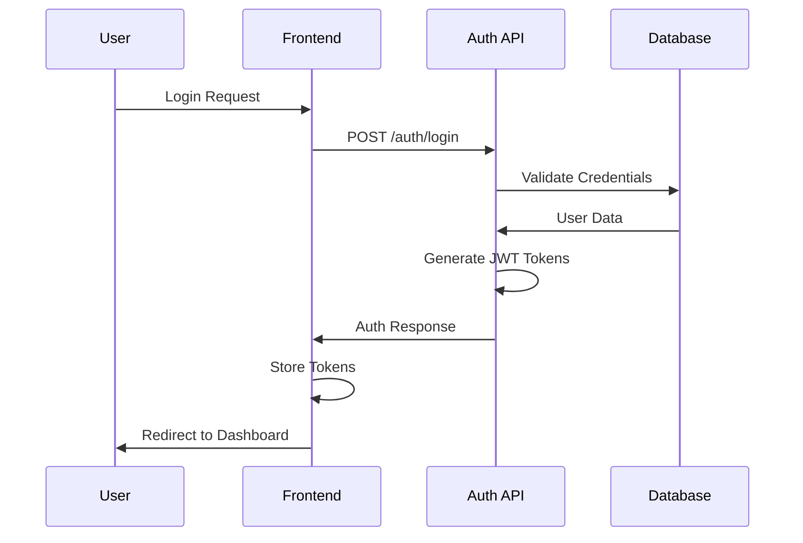
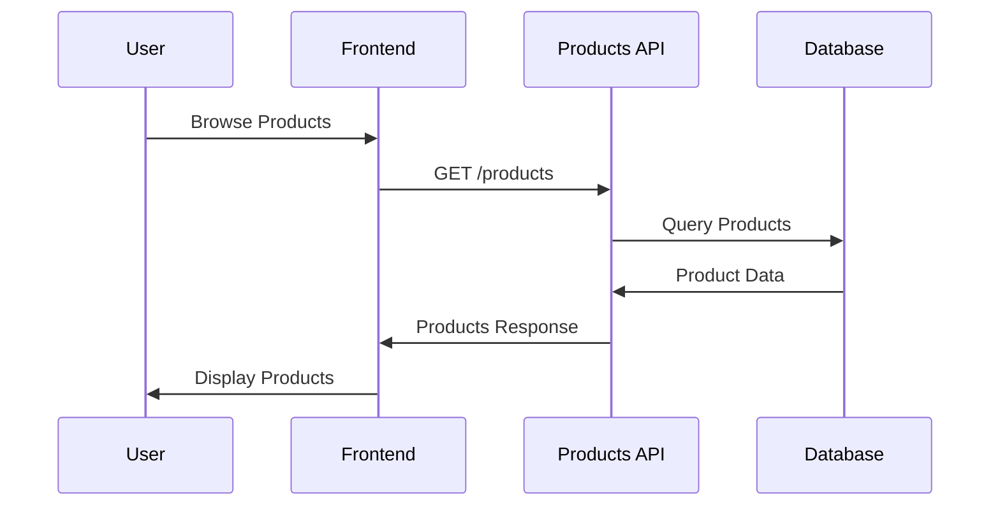
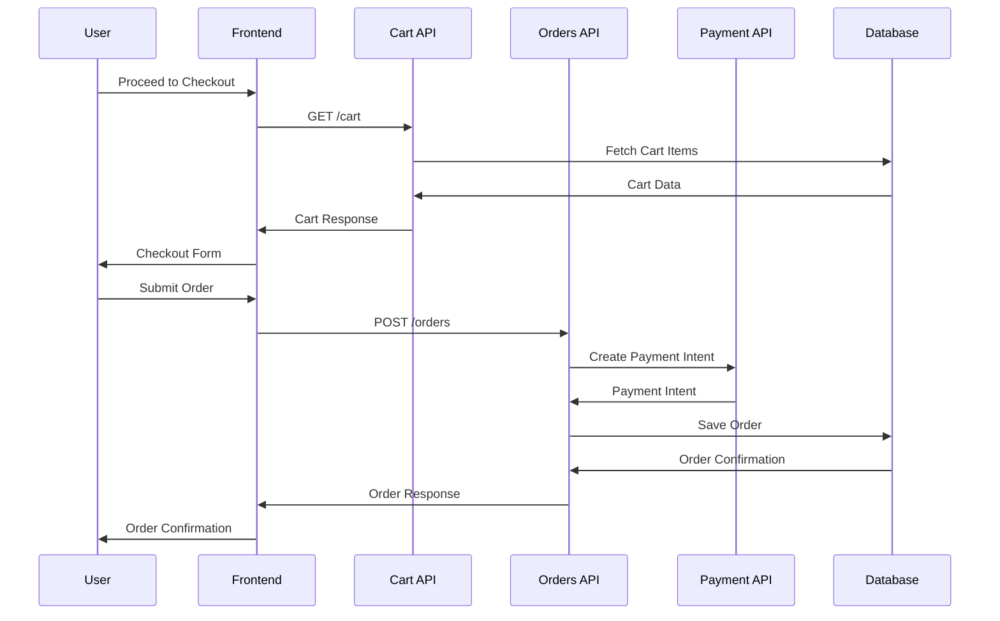

# System Architecture Overview

## 🏗️ Architecture Overview

The ANVIY e-commerce platform follows a modern, scalable architecture designed for luxury jewelry sales with high performance and user experience requirements.

## 🎯 Architecture Principles

### 1. **Component-Based Architecture**
- Modular, reusable components
- Clear separation of concerns
- Single responsibility principle

### 2. **Type Safety**
- Full TypeScript implementation
- Strict type checking
- Comprehensive type definitions

### 3. **Performance First**
- Server-side rendering (SSR)
- Static site generation (SSG)
- Optimized bundle sizes
- Image optimization

### 4. **Scalability**
- Microservices-ready API design
- Horizontal scaling support
- Caching strategies

## 🏛️ System Architecture

```
┌─────────────────────────────────────────────────────────────┐
│                    Frontend Layer                           │
├─────────────────────────────────────────────────────────────┤
│  Next.js 14 App Router                                      │
│  ├── (auth) - Authentication Pages                          │
│  ├── (shop) - Shop & Product Pages                          │
│  ├── (cart) - Cart & Checkout                               │
│  └── (cms) - Admin Dashboard                                │
├─────────────────────────────────────────────────────────────┤
│  React 18 + TypeScript                                      │
│  ├── Components                                             │
│  ├── Hooks                                                  │
│  └── Context Providers                                      │
├─────────────────────────────────────────────────────────────┤
│  State Management (Zustand)                                 │
│  ├── Authentication Store                                   │
│  ├── Cart Store                                             │
│  └── Favorites Store                                        │
└─────────────────────────────────────────────────────────────┘
                              │
                              ▼
┌─────────────────────────────────────────────────────────────┐
│                    API Layer                                │
├─────────────────────────────────────────────────────────────┤
│  RESTful API (Express.js/Next.js API Routes)               │
│  ├── Authentication API                                     │
│  ├── Products API                                           │
│  ├── Cart API                                               │
│  ├── Orders API                                             │
│  └── User Management API                                    │
└─────────────────────────────────────────────────────────────┘
                              │
                              ▼
┌─────────────────────────────────────────────────────────────┐
│                  Service Layer                              │
├─────────────────────────────────────────────────────────────┤
│  Business Logic Services                                    │
│  ├── Authentication Service                                 │
│  ├── Product Service                                        │
│  ├── Order Service                                          │
│  ├── Payment Service                                        │
│  └── Email Service                                          │
└─────────────────────────────────────────────────────────────┘
                              │
                              ▼
┌─────────────────────────────────────────────────────────────┐
│                  Data Layer                                 │
├─────────────────────────────────────────────────────────────┤
│  Database (PostgreSQL)                                      │
│  ├── Users                                                  │
│  ├── Products                                               │
│  ├── Orders                                                 │
│  ├── Cart Items                                             │
│  └── Reviews                                                │
├─────────────────────────────────────────────────────────────┤
│  External Services                                          │
│  ├── Payment Gateway (Stripe/Razorpay)                     │
│  ├── Email Service (SendGrid)                               │
│  ├── File Storage (AWS S3)                                  │
│  └── Search (Algolia)                                       │
└─────────────────────────────────────────────────────────────┘
```

## 📁 Project Structure

### Frontend Structure

```
src/
├── app/                          # Next.js App Router
│   ├── (auth)/                   # Authentication group
│   │   ├── login/
│   │   │   └── page.tsx
│   │   ├── register/
│   │   │   └── page.tsx
│   │   └── layout.tsx
│   ├── (shop)/                   # Shop group
│   │   ├── components/           # Shop-specific components
│   │   ├── shop/
│   │   │   └── page.tsx
│   │   ├── product/
│   │   │   └── [slug]/
│   │   │       └── page.tsx
│   │   ├── checkout/
│   │   │   └── page.tsx
│   │   └── layout.tsx
│   ├── (cart)/                   # Cart group
│   │   └── cart/
│   │       └── page.tsx
│   ├── (cms)/                    # Admin CMS group
│   │   └── admin/
│   │       └── page.tsx
│   ├── globals.css               # Global styles
│   ├── layout.tsx                # Root layout
│   └── page.tsx                  # Homepage
├── components/                   # Shared components
│   ├── ui/                       # Base UI components
│   └── forms/                    # Form components
├── lib/                          # Utility libraries
│   ├── api.ts                    # API client
│   ├── utils.ts                  # Utility functions
│   └── constants.ts              # Constants
├── store/                        # State management
│   ├── auth.ts                   # Authentication store
│   ├── cart.ts                   # Cart store
│   └── favorites.ts              # Favorites store
├── types/                        # TypeScript types
│   ├── api.ts                    # API types
│   └── common.ts                 # Common types
└── styles/                       # Additional styles
```

### Backend Structure (Future)

```
backend/
├── src/
│   ├── controllers/              # Route controllers
│   ├── services/                 # Business logic
│   ├── models/                   # Data models
│   ├── middleware/               # Custom middleware
│   ├── routes/                   # API routes
│   ├── utils/                    # Utility functions
│   └── config/                   # Configuration
├── prisma/                       # Database schema
│   └── schema.prisma
├── tests/                        # Test files
└── package.json
```

## 🔄 Data Flow

### 1. **User Authentication Flow**



### 2. **Product Browsing Flow**



### 3. **Checkout Flow**



## 🎨 Design System Architecture

### Component Hierarchy

```
Design System
├── Foundation
│   ├── Colors
│   ├── Typography
│   ├── Spacing
│   └── Shadows
├── Atoms
│   ├── Button
│   ├── Input
│   ├── Icon
│   └── Badge
├── Molecules
│   ├── ProductCard
│   ├── SearchBar
│   ├── Navigation
│   └── FormField
├── Organisms
│   ├── Header
│   ├── Footer
│   ├── ProductGrid
│   └── CheckoutForm
└── Templates
    ├── ProductPage
    ├── CheckoutPage
    └── DashboardPage
```

## 🔐 Security Architecture

### 1. **Authentication & Authorization**

- **JWT Tokens**: Access and refresh token system
- **Token Refresh**: Automatic token renewal
- **Route Protection**: Client and server-side protection
- **Role-Based Access**: User roles and permissions

### 2. **Data Security**

- **HTTPS Only**: All communications encrypted
- **Input Validation**: Server-side validation
- **SQL Injection Prevention**: Parameterized queries
- **XSS Protection**: Content Security Policy

### 3. **Payment Security**

- **PCI Compliance**: Secure payment processing
- **Tokenization**: Sensitive data tokenization
- **Webhook Verification**: Secure webhook handling

## 🚀 Performance Architecture

### 1. **Frontend Optimization**

- **Code Splitting**: Dynamic imports
- **Image Optimization**: Next.js Image component
- **Bundle Optimization**: Tree shaking and minification
- **Caching**: Static asset caching

### 2. **Backend Optimization**

- **Database Indexing**: Optimized queries
- **Caching**: Redis caching layer
- **CDN**: Content delivery network
- **Load Balancing**: Horizontal scaling

### 3. **Monitoring & Analytics**

- **Performance Monitoring**: Core Web Vitals
- **Error Tracking**: Error boundary and logging
- **User Analytics**: User behavior tracking
- **Business Metrics**: Conversion tracking

## 🔧 Technology Stack

### Frontend
- **Framework**: Next.js 14 (App Router)
- **Language**: TypeScript
- **Styling**: Tailwind CSS
- **State Management**: Zustand
- **Forms**: React Hook Form
- **Validation**: Zod

### Backend (Planned)
- **Runtime**: Node.js
- **Framework**: Express.js or Next.js API Routes
- **Database**: PostgreSQL
- **ORM**: Prisma
- **Authentication**: JWT
- **Payment**: Stripe/Razorpay

### Infrastructure
- **Hosting**: Vercel/Netlify
- **Database**: Supabase/AWS RDS
- **Storage**: AWS S3
- **CDN**: Cloudflare
- **Monitoring**: Sentry

## 📈 Scalability Considerations

### 1. **Horizontal Scaling**

- **Stateless Design**: No server-side sessions
- **Load Balancing**: Multiple server instances
- **Database Sharding**: Horizontal database scaling
- **Microservices**: Service decomposition

### 2. **Performance Optimization**

- **Caching Strategy**: Multi-layer caching
- **Database Optimization**: Query optimization
- **CDN**: Global content delivery
- **Image Optimization**: WebP format, lazy loading

### 3. **Monitoring & Alerting**

- **Application Monitoring**: Performance metrics
- **Error Tracking**: Real-time error monitoring
- **Business Metrics**: Conversion tracking
- **Infrastructure Monitoring**: Server health

## 🔄 Deployment Architecture

### Development Environment
- **Local Development**: Docker containers
- **Hot Reloading**: Fast development cycles
- **Environment Variables**: Local configuration
- **Database**: Local PostgreSQL instance

### Staging Environment
- **Preview Deployments**: Automatic staging
- **Testing**: Integration and E2E tests
- **Performance Testing**: Load testing
- **Security Scanning**: Vulnerability assessment

### Production Environment
- **Blue-Green Deployment**: Zero-downtime deployments
- **Auto-scaling**: Dynamic resource allocation
- **Monitoring**: Real-time monitoring
- **Backup Strategy**: Automated backups

---

**Last Updated**: December 2024  
**Version**: 1.0.0  
**Architecture Version**: 2.0
